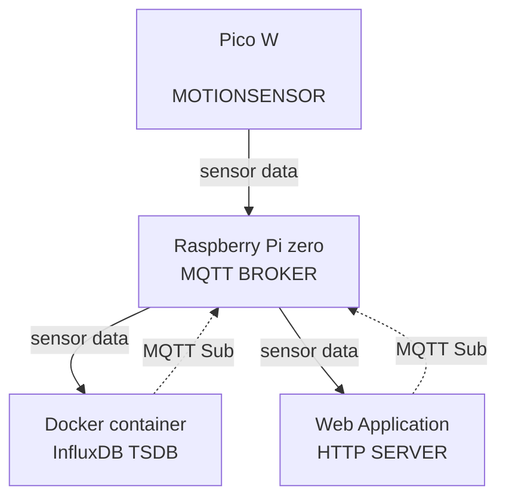

# security-application

```mermaid
flowchart TD
  pico["Pico W 
  
  MOTIONSENSOR"]
  fog["Raspberry Pi zero
  MQTT BROKER"]
  
  influxdb["Docker container
            InfluxDB TSDB"]
  webbapp["Web Application
           HTTP SERVER"]            
            
         
 
 pico --> |"sensor data"| fog
 fog -->|"sensor data"| influxdb
 influxdb -.-> |"MQTT Sub"| fog
 
 webbapp -.-> |"MQTT Sub"| fog
 fog --> |"sensor data" | webbapp
```
