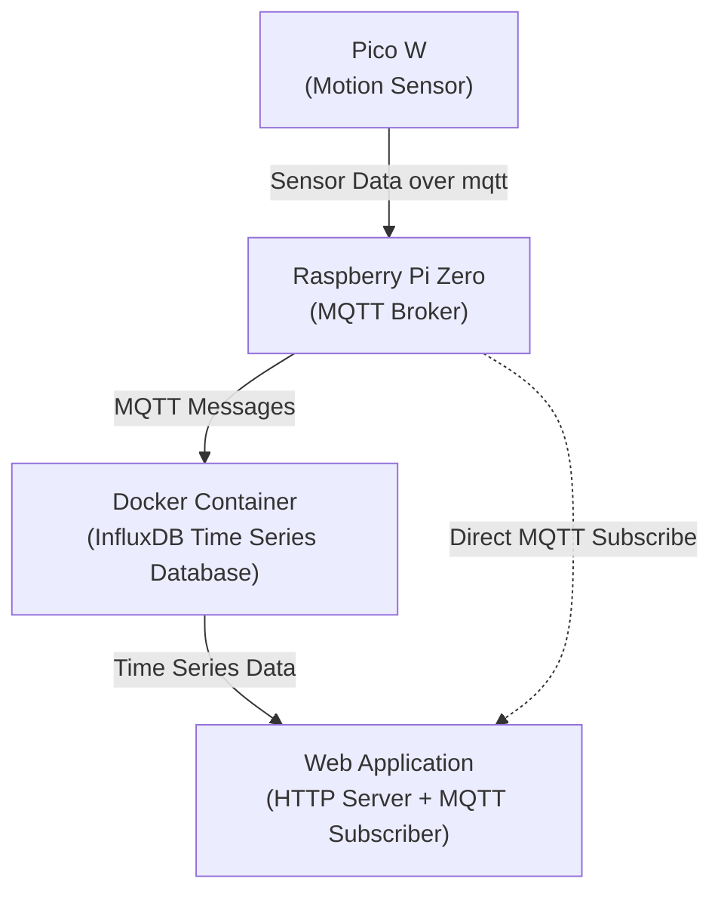

# security-application

```mermaid
flowchart TD
    pico["Pico W\n(Motion Sensor)"]
    fog["Raspberry Pi Zero\n(MQTT Broker)"]
    influxdb["Docker Container\n(InfluxDB Time Series Database)"]
    webapp["Web Application\n(HTTP Server + MQTT Subscriber)"]
    
    pico -->|"Sensor Data over mqtt"| fog
    fog -->|"MQTT Messages"| influxdb
    influxdb -->|"Time Series Data"| webapp
    fog -.->|"Direct MQTT Subscribe"| webapp
```
